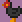
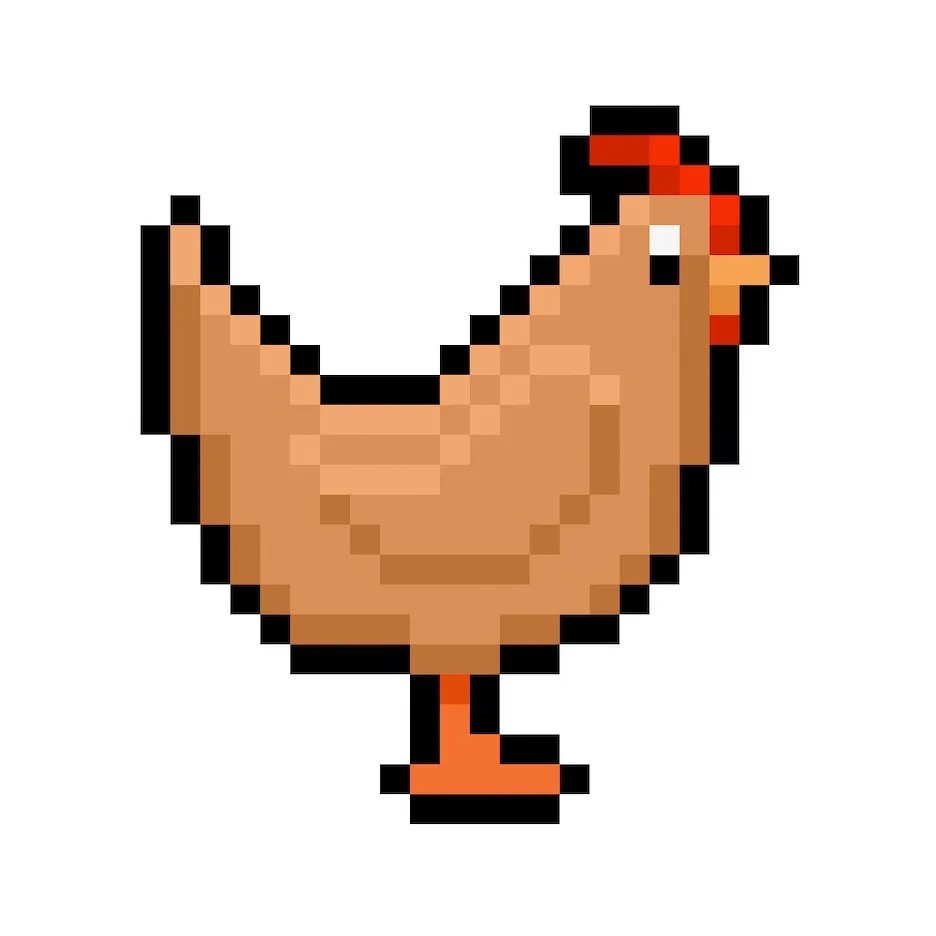
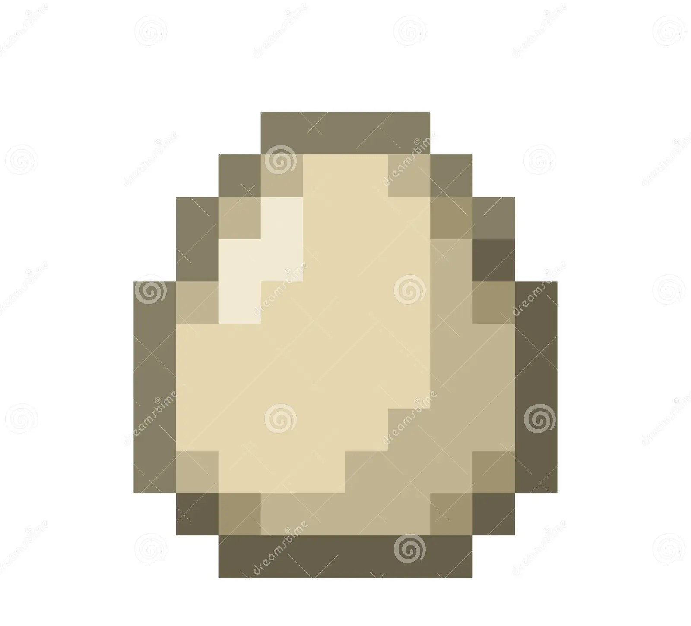
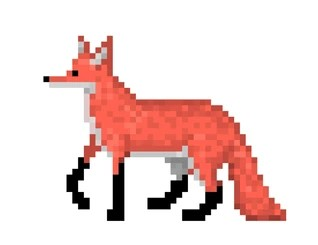

# Eggcode-Studios

# Game ideas
### Egg Platformer
- A 2D Platformer where you play as a chicken fighting off foxes by shooting eggs at them.

 #### Weapons
 1. Boiled Egg (pistol): single shot projectile that does good damage and travels in a straight line
 2. Cracked Egg (shotgun): Shotgun like projectile that does lots of damage to close up targets
 3. Hard Boiled Egg (slingshot): A single shot projectile that bounces across the floor until it hits a target
 4. Rotten Egg (Grenade launcher): A single shot projectile that explodes dealing AOE damage
 #### Mechanics
 1. Movement 
 2. Jumping
 3. Gliding 
 4. Shooting
 5. Switching ammo types 
 6. Health 
 7. Eggs
 8. Damage and enemy health 
 9. Enemies and enemy types
 10. Camera side scrolling
 11. Reloading
 #### Game Features And Setting
 - Game Setting - Chicken farm
 - Art Style - Pixel Art
 - 2D platformer
 - Side Scroller
 #### Game Engine
 - Unity
 #### Controls
 - A - Move Left
 - D - Move Right
 - Space - Jump
 - Space(While in the air) - Glide
 - Left Click - Shoot
 - Right Click - Change ammo type
 #### Enemy Ideas
| Enemy | Specail attribute | Attack | Design |
| --- | --- | --- | --- |
| Basic Fox | Moves left and right | bites the player when it collides with them  | Dark grey fox with sharp teeth |
| Pouncing Fox | Pounces at the player when they get near them | Pouce and bite |  |
| Shooty fox | Stays still | shoots at the player |  |
| Brawler Fox | Slower than the basic fox and takes more damage | Attacks the player on collision | Big buff wolf |

 |Chicken |Description | inspiring image |
 |--------|------------|-----------------|
 |Player chicken | Brown, yellow beak, yellow or orange feet, slightly smaller than the mother chicken|  
 |Mother chicken| slightly bigger, red fluff on head, more of a hen than a chick | 
 

 # Moodboard 
 
 
 
 
 

(https://opengameart.org/content/chicken-sprites ) 
(https://www.megavoxels.com/learn/how-to-make-a-pixel-art-chicken/)

 
